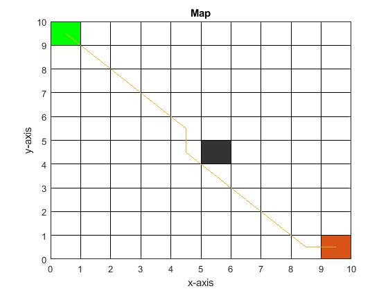
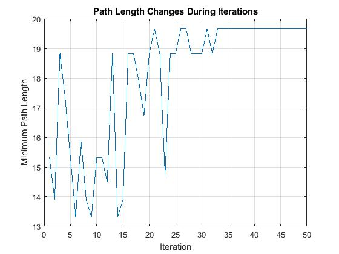
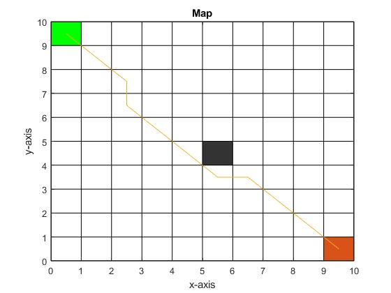
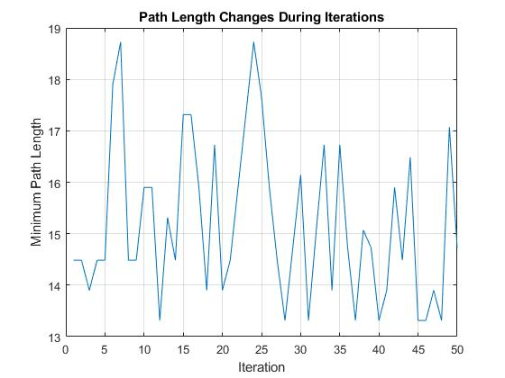
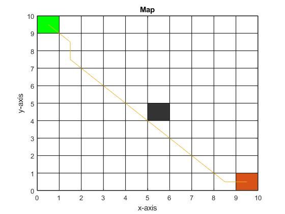
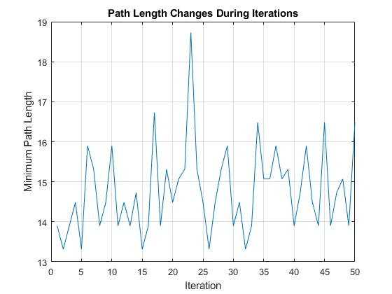

This is the 2nd version.
**Date: 20 March 2022

# Actions Log

At this stage, the main task is to **test different scenarios** and see if there is any bugs prompt out. 

Then, modify the programme to improve the performance in terms of **accuracy, stability and response speed**. 

Lastly, prepare **presentation** to introduce algorithms used in detail at Monday's meeting.

## 1. Obstacles

### Obstacles added.
```
gridMap(2:9, 5) = 1;
```
* Think about:

  * How to find the best solution by hand-calculation and compare with the result from the programme when the map gets more and more complex?
  * TBC...

## 2. &Delta;(r, s) array generation

### 🐭 Bug occurred: 

* Can't detect obstacle at gridMap(88) and some surrounding grids when
  ```
  gridMap(9, 4:8) = 1;
  gridMap(4:9, 9) = 1;
  ```
* Check data detail in file [globalDelta_Bug.xlsx](../1-Non-Obstacles/globalDelta_Bug.xlsx)
* Original code in [delta_r2s.m](../1-Non-Obstacles/delta_r2s.m)
```
function D = delta_r2s(arr) % delta_(r,s): cost from grid r to grid s
                                % r and s must be next to each other ssss
    row = size(arr, 1);         % the number of rows of the array 
    column = size(arr, 2);
    D = zeros(row*column);     % initialise the delta_(r,s) matrix
    % Outer Loop
    for i = 1:row               
        for j = 1:column           % Outter Loop: Traverse all the grids to set their cost 
                                % of traveling to the local surrouding grids
            if arr(i, j) == 0   % grid r must not be a obstacle
                
                % Inner Loop
                for x = 1:row
                    for y = 1:column % Inner Loop: find the surrounding available 
                                     % grids s and return the cost value
                                     % (distance) to the exact variable in
                                     % the matrix
                        if arr(x, y) == 0 % the surrounding grid must be clear
                            rel_x = abs(i - x); % relative distance between grid r and s on x direction
                            rel_y = abs(j - y); % relative distance between grid r and s on y direction
                            if rel_x + rel_y == 1 || (rel_x == 1 && rel_y == 1)
                                % When this grid is one of the adjacent
                                % grids in 8 directions
                                D((i-1)*column + j, (x-1)*column + y) = sqrt(rel_x^2 + rel_y^2); 
                                % D(r, s), r and s are indices of one-dimensional matrix
                                % Return relative distance between r and s
                            end
                        end
                    end
                end
            end
        end
    end

end
```

### ✔️ Solution:

* Updated the generation process [calcDelta.m](calcDelta.m)

 ```
 function D = calcDelta(arr)
 row = size(arr, 1);         % the number of rows of the array 
 column = size(arr, 2);
 D = zeros(row*column);     % initialise the delta_(r,s) matrix
 for i = 1: row*column
     if arr(i) == 0
        for j = 1: row*column
           if arr(j) == 0 && (abs(i - j) == 11 || abs(i - j) == 10 || abs(i - j) == 9 || abs(i - j) == 1)
               [x1, y1] = ConvertXY(j, row);
               [x2, y2] = ConvertXY(i, row);
               D(i, j) = sqrt((x1 - x2)^2 + (y1 - y2)^2);
               D(j, i) = sqrt((x1 - x2)^2 + (y1 - y2)^2);
           end
        end
     end
 end

 end
 ```

## 3. Modify pheromone evaporation rate &Delta;&tau;

Changing _&Delta;&tau;_ can improve the accuracy, which means the higher chance of returning the expected answer.


### 🐭 Bug: Path length converging at the highest level

The length-iteration diagram was expected to show the convergence at the lowest value instead of the greatest value.


|:--:| 
| *Robot path records* |


|:--:|
| *Length-Iteration diagram* |

### 📆 21 March 2022 Update

  * Pheromone update rules mis-coded ❎
    ```
    % 2.4 Update the intensity of pheromone on the path
    deltaTau = zeros(size(tau));
    for i = 1: numAnts
        if pathLength(Gen, Ant)
            pathTemp = pathStorage{Gen, Ant};
            pathInterval = length(pathTemp) - 1;
            for j = 1: pathInterval
                deltaTau(pathTemp(j), pathTemp(j + 1)) = 1 / pathLength(Gen, Ant);
                deltaTau(pathTemp(j + 1), pathTemp(j)) = 1 / pathLength(Gen, Ant);
            end
        end
    end
    tau = (1 - alpha) .* tau + deltaTau; % pheromone evaporation rule
    ```
#### :hammer: Debug Attempt: 
   
the _pathLength(Gen, **Ant**)_ should be _pathLength(Gen, **i**)_
        
:black_nib: Thougth:	If it followed the first code, it would only update the pheromone based on **the last ant's path**.

* Code:
```
% 2.4 Update the intensity of pheromone on the path
    deltaTau = zeros(size(tau));
    for i = 1: numAnts
        if pathLength(Gen, i)
            pathTemp = pathStorage{Gen, i};
            for j = 1: size(pathTemp)
                deltaTau(pathTemp(j)) = deltaTau(pathTemp(j)) + 1 / pathLength(Gen, i);
            end
        end
    end
    tau = (1 - alpha) .* tau + deltaTau; % pheromone evaporation rule
```
* Resulte: Still not converging to the smallest value
 * Change the Pheromone update rule &tau;(r, s), using 2D array
 

|:--:| 
| *Robot path records: changed the pheromone update rule* |


|:--:|
| *Length-Iteration diagram: changed the pheromone update rule* |

 * Change the relative importance of pheromone = 4
  ```
 % Original
stateTransProb(i) = tau(indexDelta(i)) * eta(indexDelta(i))^beta;
 
 % NEW
 stateTransProb(i) = tau(indexDelta(i))^4 * eta(indexDelta(i))^beta;
  ```

|:--:| 
| *Robot path records: changed the pheromone update rule* |


|:--:|
| *Length-Iteration diagram: changed the pheromone update rule* |
