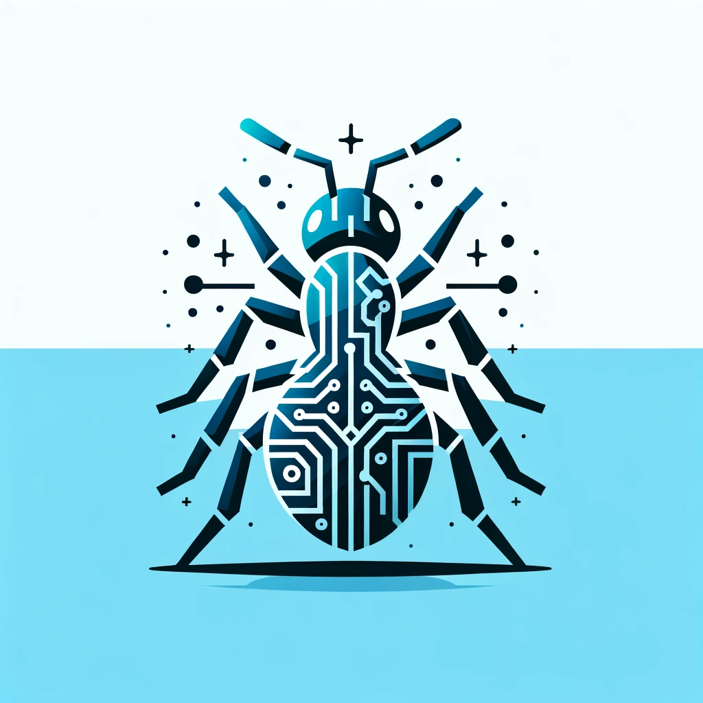
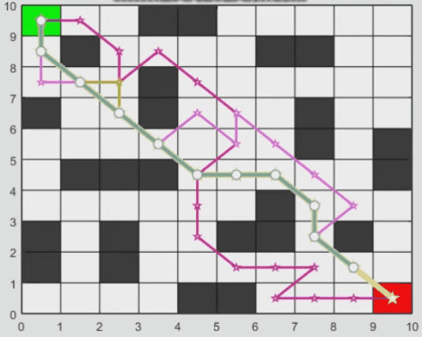

<!-- Improved compatibility of back to top link: See: https://github.com/othneildrew/Best-README-Template/pull/73 -->
<a name="readme-top"></a>


<!-- PROJECT LOGO -->
<br />
<div align="center">
  <a href="https://github.com/onlyEugeneLi/ACO-RobotPathPlanning-MATLAB">
    
  </a>

  <h3 align="center">Ant Colony Optimisation (ACO) for Robot Path Planning</h3>

  <p align="center">
    This report presents the visualisations and analysis of using ACO to address NP-hard complexity within Robot Path Planning problems.
    <br />
    <a href="https://github.com/onlyEugeneLi/ACO-RobotPathPlanning-MATLAB/tree/main"><strong>Explore the docs »</strong></a>
    <br />
    <br />
    <a href="https://github.com/onlyEugeneLi/ACO-RobotPathPlanning-MATLAB/tree/main">View Demo</a>
    ·
    <a href="https://github.com/onlyEugeneLi/ACO-RobotPathPlanning-MATLAB/issues">Report Bug</a>
    ·
    <a href="https://github.com/onlyEugeneLi/ACO-RobotPathPlanning-MATLAB/issues">Request Feature</a>
  </p>
</div>


<!-- TABLE OF CONTENTS -->
<details>
  <summary>Table of Contents</summary>
  <ol>
    <li>
      <a href="#about-the-project">About The Project</a>
      <ul>
        <li><a href="#built-with">Built With</a></li>
      </ul>
    </li>
    <li>
      <a href="#getting-started">Getting Started</a>
      <ul>
        <li><a href="#prerequisites">Prerequisites</a></li>
        <li><a href="#installation">Installation</a></li>
      </ul>
    </li>
    <li><a href="#usage">Usage</a></li>
    <li><a href="#roadmap">Roadmap</a></li>
    <li><a href="#contributing">Contributing</a></li>
    <li><a href="#license">License</a></li>
    <li><a href="#contact">Contact</a></li>
    <li><a href="#acknowledgments">Acknowledgments</a></li>
  </ol>
</details>


<!-- ABOUT THE PROJECT -->
## About The Project

**Why robot path planning matters**: Picture a robot in your local warehouse, deftly weaving through stacks of boxes to fulfill your online shopping orders. Or imagine self-driving cars effortlessly navigating complex city streets. It's all about efficient path planning! 📦🚗

Robot path planning is like a GPS for robots. It helps them find the best way from A to B while dodging obstacles, saving time, and conserving energy. It's the brain behind the bots!

**Enter Ant Colony Optimisation!** Now, here's where it gets exciting. We're introducing ACO, a nature-inspired algorithm that mimics how ants find the shortest path to food. 🐜🍔

ACO is our robot's secret sauce. It's like giving them a sixth sense for navigating tricky terrains. By laying down 'virtual pheromones,' our robots learn and adapt, discovering the optimal routes in changing environments.

### A glimpse at the artificial ant colony

Take a look at the final outcome of the work!



* 🎞️ Above animation visualises how the **artificial ant colony** navigate in a world full of obstacles.
* 🧀 Their goal is to identify the best (shortest and obstacle-free) route from their nest 🟢 to the food resources 🔴.
* ⛵ **Exploration**: They firstly bravely explore many possible routes because of no prior knowledge of the world.
* 🧔 **Learn from excellent peers**: Then they quickly learn from their past experiences.
* 🥇 **Team work wins!** Eventually, all of them merge on the optimal route!

<p align="right">(<a href="#readme-top">back to top</a>)</p>

### How it works

- :ant: Ant Colony Optimization (ACO) is like a picnic adventure for ants!
- :sandwich: Ants need to find the shortest path to their favorite sandwich.
- :world_map: Many paths to choose from, no GPS for ants!
- :walking_man: Ants leave scented breadcrumbs called **'pheromones'** as they explore.
- :nose: Strong pheromone smell means "This way to the sandwich!"
- :walking_woman: Other ants **follow the strong pheromone trail**.
- :briefcase: More ants travel the same path, making the trail even stronger.
- :railway_track: Ants **converge** on the shortest, most efficient route.
- :robot: ACO mimics this natural process to solve complex problems for computers.
- :exploding_head: Helps robots find their way through mazes and optimises delivery routes.
- :earth_americas: Nature's way of showing us how to navigate the world, one picnic at a time! :ant::sandwich::world_map:

## Getting started


## Archived Logs

The following is archived records of edit history.

### Update dates & details
Ver. 17 Mar 2022
* Bug cleared
* No obstacles in the map
  ```
  numAnts = 17;
  numGen = 20;
  ```
* To ensure to find the diagonal-shortest path, deployed precedent parameters

Ver. 20 Mar 2022
* Added obstacles to the map
  ```
  gripMap(2:9, 5) = 1;
  ```
  * Ran well, but need to improve the accuracy and stability

* Solved a fail-to-detect-obstacles issue
  * When using the Delta_r2r(arr) function, globalDelta stored obstacles in the array by mistake.
  * Bug source still not found
 
<!-- MARKDOWN LINKS & IMAGES -->

[JQuery-url]: https://jquery.com 
