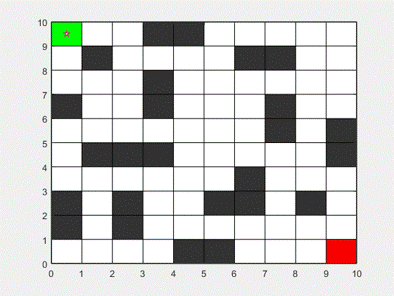

<!-- Improved compatibility of back to top link: See: https://github.com/othneildrew/Best-README-Template/pull/73 -->
<a name="readme-top"></a>


<!-- PROJECT LOGO -->
<br />
<div align="center">
  <a href="https://github.com/onlyEugeneLi/ACO-RobotPathPlanning-MATLAB">
    
  </a>

  <h3 align="center">Ant Colony Optimisation (ACO) for Robot Path Planning</h3>

  <p align="center">
    This report presents the visualisations and analysis of using ACO to address NP-hard complexity within Robot Path Planning problems.
    <br />
    <a href="https://github.com/onlyEugeneLi/ACO-RobotPathPlanning-MATLAB/tree/main"><strong>Explore the docs »</strong></a>
    <br />
    <br />
    <a href="https://github.com/onlyEugeneLi/ACO-RobotPathPlanning-MATLAB/tree/main">View Demo</a>
    ·
    <a href="https://github.com/onlyEugeneLi/ACO-RobotPathPlanning-MATLAB/issues">Report Bug</a>
    ·
    <a href="https://github.com/onlyEugeneLi/ACO-RobotPathPlanning-MATLAB/issues">Request Feature</a>
  </p>
</div>


<!-- TABLE OF CONTENTS -->
<details>
  <summary>Table of Contents</summary>
  <ol>
    <li>
      <a href="#about-the-project">About The Project</a>
      <ul>
        <li><a href="#built-with">Built With</a></li>
      </ul>
    </li>
    <li>
      <a href="#getting-started">Getting Started</a>
      <ul>
        <li><a href="#prerequisites">Prerequisites</a></li>
        <li><a href="#installation">Installation</a></li>
      </ul>
    </li>
    <li><a href="#usage">Usage</a></li>
    <li><a href="#roadmap">Roadmap</a></li>
    <li><a href="#contributing">Contributing</a></li>
    <li><a href="#license">License</a></li>
    <li><a href="#contact">Contact</a></li>
    <li><a href="#acknowledgments">Acknowledgments</a></li>
  </ol>
</details>


<!-- ABOUT THE PROJECT -->
## About The Project



Take a look at the final outcome of the work!

<p align="right">(<a href="#readme-top">back to top</a>)</p>


# Ant Colony Optimisation (ACO) Algorithms for Robot Path Planning

This is a project for the award of my Bachelor degree in Mechanical Engineering at University of Birmingham. 


## Archived Logs

The following is archived records of edit history.

### Update dates & details
Ver. 17 Mar 2022
* Bug cleared
* No obstacles in the map
  ```
  numAnts = 17;
  numGen = 20;
  ```
* To ensure to find the diagonal-shortest path, deployed precedent parameters

Ver. 20 Mar 2022
* Added obstacles to the map
  ```
  gripMap(2:9, 5) = 1;
  ```
  * Ran well, but need to improve the accuracy and stability

* Solved a fail-to-detect-obstacles issue
  * When using the Delta_r2r(arr) function, globalDelta stored obstacles in the array by mistake.
  * Bug source still not found
 
<!-- MARKDOWN LINKS & IMAGES -->
[result-gif]: image/final_demo.gif
